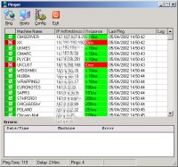



## VBPinger

### Description

A complete ICMP Ping program for VB demonstrating the use of the API to create Winsock calls. Allows the pinging of multiple hosts and logging of any failures... completely configurable by the user.

This is my first submission to PSC so any feedback (good or otherwise) will be appreciated.
 
### More Info
 

             |
---                |---
**Submitted On**   |2002-04-05 14:54:10
**By**             |[Merc](https://github.com/Planet-Source-Code/PSCIndex/blob/master/ByAuthor/merc.md)
**Level**          |Intermediate
**User Rating**    |4.8 (57 globes from 12 users)
**Compatibility**  |VB 6\.0
**Category**       |[Complete Applications](https://github.com/Planet-Source-Code/PSCIndex/blob/master/ByCategory/complete-applications__1-27.md)
**World**          |[Visual Basic](https://github.com/Planet-Source-Code/PSCIndex/blob/master/ByWorld/visual-basic.md)
**Archive File**   |[VBPinger69022452002\.zip](https://github.com/Planet-Source-Code/merc-vbpinger__1-33465/archive/master.zip)

